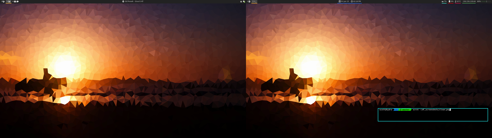
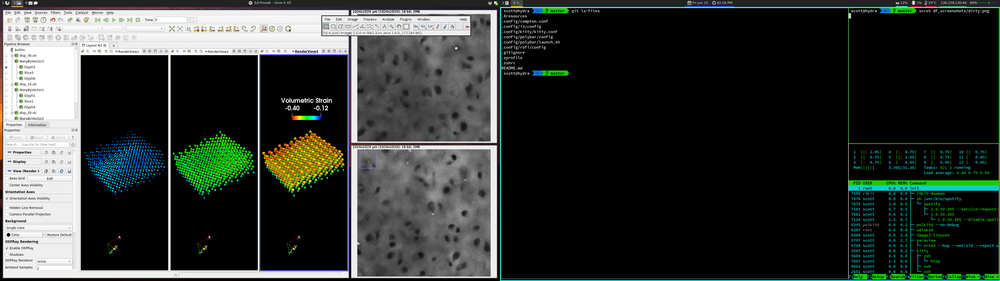

## Description
These are the dotfiles pertinent to my system configuration and workflow. I start a few programs in my i3 config that you may need to disable. These are:

* dropbox-cli
* thunderbird
* [redshift](http://jonls.dk/redshift/)
* pidgin

You can delete the lines that exec these in .config/i3/config.

## Screenshots

#### Clean

#### Dirty

## Dependencies
* [i3-gaps](https://github.com/Airblader/i3) This fork of i3 may be available in your distribution's repository. If you want to just use i3wm remove/comment the blocked section i3-gaps options .config/i3/config.
* [oh-my-zsh](https://github.com/robbyrussell/oh-my-zsh) If you are using another shell i.e. BASH then you don't need this. 
* [rofi](https://github.com/DaveDavenport/rofi) Again check your distribution's repository first.
* [polybar](https://github.com/jaagr/polybar) Not in main repositories. See Getting Started on their readme.
* [picom-ibhagwan](https://github.com/ibhagwan/picom) This screen compositer is not necessary. It just enables rounded corners and transparency/blur. Just comment out the lines starting it in .config/i3/config.
* alacritty - Terminal
* neovim (spacevim) - Change the EDITOR and GIT_EDITOR variables in .zprofile if you want to use something different.
* feh - Image viewer to set the background
